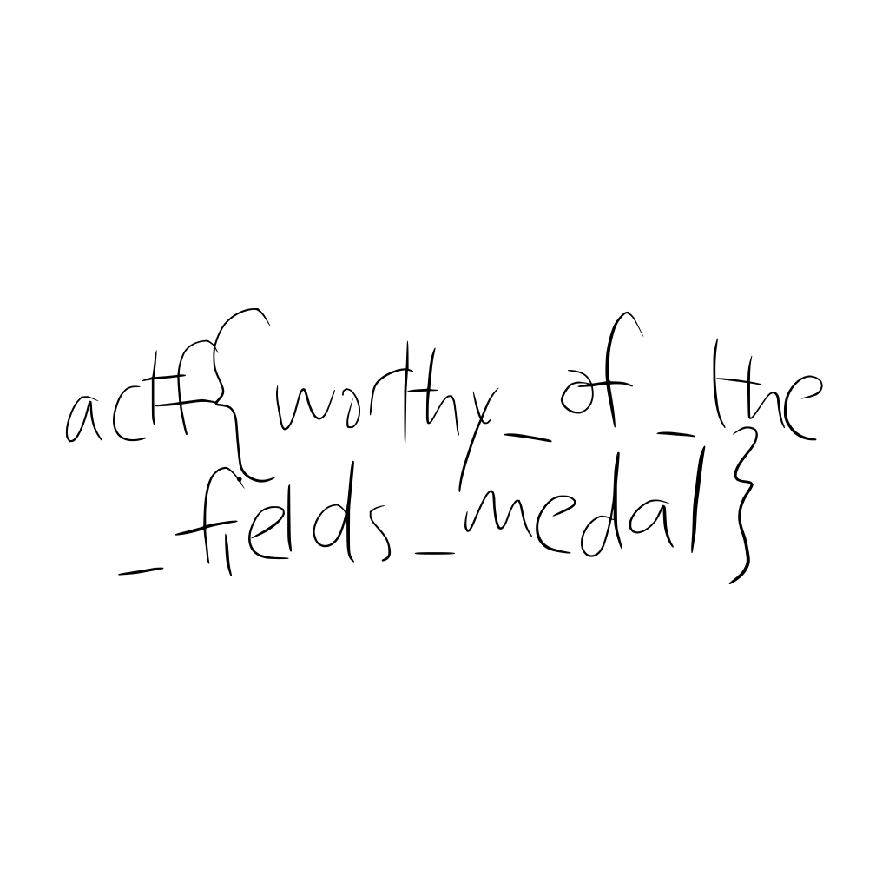

# Paper Cut
Misc (190 points, 42 solves)

## Challenge 

defund submitted a math paper to a research conference and received a few comments from the editors. Unfortunately, we only have a [fragment](https://files.actf.co/ab0ba68436262dd0989939f80ef3c37f980c2c43d8beaf169a07b123d37f7620/paper_cut.pdf) of the returned paper.

Author: defund

## Solution

Note: I did not solve this during the contest. 

We are given a PDF document, but it does not open. Using a text/hex editor, we can see that it is PDF 1.3 file, but it does not have a cross reference table or trailer. 

I initially attempted to reconstruct these parts using the [PDF 1.3 Reference Manual](https://www.pdfill.com/download/PDFSPEC13.pdf). I was not successful in doing this. 

Next, I used [this script](https://gist.github.com/averagesecurityguy/ba8d9ed3c59c1deffbd1390dafa5a3c2) to decode the Zlib data in the first `FlateDecode` stream and outputted it to a file. Since the stream is not complete, I had to change the script a little to work.

```python
import zlib

pdf = open("paper_cut.pdf", "rb").read()
stream = pdf.split(b"stream")[1].strip()
data = zlib.decompressobj().decompress(stream)
```

This was as far as I got during the contest. I saw some text but couldn't find anything that looked like a flag. 

There is actually a bunch of [PostScript](https://www-cdf.fnal.gov/offline/PostScript/BLUEBOOK.PDF) drawing instructions at the bottom of the file. `m` is a `moveto`, `c` is a `curveto`, `l` is a `lineto`, and `f` is a `fill`. [defund's solution](https://github.com/defund/ctf/blob/master/angstromctf-2019/misc/paper_cut/solve.py) uses [pycairo](https://github.com/pygobject/pycairo) to turn these instructions into an image. 



## Flag

```
actf{worthy_of_the_fields_medal}
```