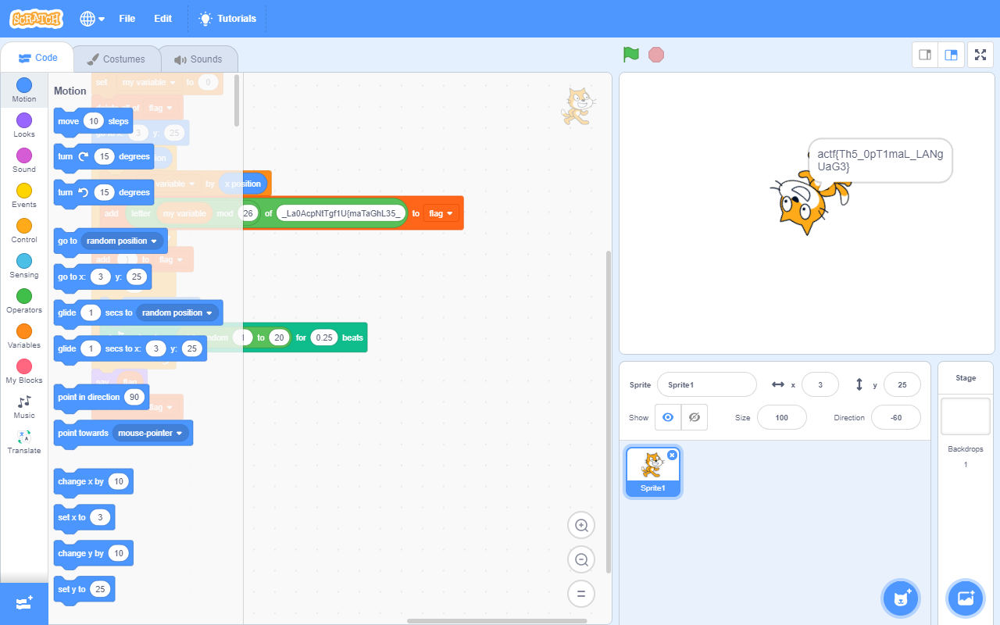

# Scratch It Out
Misc (60 points, 276 solves)

## Challenge 

An oddly yellow cat handed me this [message](https://files.actf.co/397a7663cfc657bea92b8038eb2a27804ac75ba56b74e56572e57f00414fd43f/project.json) - what could it mean?

Author: innoviox

## Hint

Zipped with standard files.

## Solution

The problem title and the reference to "an oddly yellow cat" made me think of [Scratch](https://scratch.mit.edu/). I happened to have Scratch Desktop installed already so I opened up the "project.json" file we are given. 

After clicking the green flag and waiting a bit, we get the flag. 



## Flag

```
actf{Th5_0pT1maL_LANgUaG3}
```